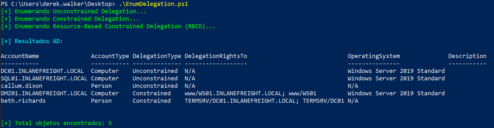

# 🎯 EnumDelegation.ps1 — Herramienta para Enumerar Delegación en Active Directory

> **Enumeración 100% independiente de PowerView, Impacket o módulos externos. Funciona en cualquier Windows 7+ con PowerShell 2.0+.**

---

## 📌 Descripción

`EnumDelegation.ps1` es una herramienta de pentesting ofensivo diseñada para **enumerar todos los tipos de delegación en Active Directory**:

- ✅ **Unconstrained Delegation**
- ✅ **Constrained Delegation**
- ✅ **Resource-Based Constrained Delegation (RBCD)**

Ideal para **pentesters, red teams y evaluadores de seguridad** que necesitan identificar vectores de escalada de privilegios en entornos AD, sin depender de herramientas externas como PowerView o Impacket.

---

## 🚀 ¿Para qué sirve?

- Detectar hosts o usuarios con **delegación sin restricciones** (Unconstrained) → potencial para capturar TGTs.
- Identificar objetos con **delegación restringida** (Constrained) → vector para ataques S4U2Self/S4U2Proxy.
- Encontrar configuraciones de **RBCD** → explotables con técnicas como "PrinterBug + Rubeus" o "Impacket getST".
- Generar reportes limpios y exportables para análisis posterior o integración con otras herramientas.

---

## ⚙️ Requisitos

- **Windows 7 / Server 2008 R2 o superior**
- **PowerShell 2.0+** (incluido por defecto en todos los sistemas modernos)
- **Conectividad LDAP al dominio** (puerto 389/636 abierto)
- **Credenciales de usuario autenticado en el dominio** (no se requiere admin local ni privilegios elevados)

---

## 📥 Uso

### 1. Ejecuta el script desde PowerShell:

```bash
.\EnumDelegation.ps1
```

### 2. Especifica un dominio (si no es el actual):

```bash
.\EnumDelegation.ps1 -Domain "INLANEFREIGHT.LOCAL"
```

### 3. Exporta resultados a CSV:

```bash
.\EnumDelegation.ps1 -OutputPath "C:\temp\DelegationReport.csv"
```

## ✅ Ejemplo


